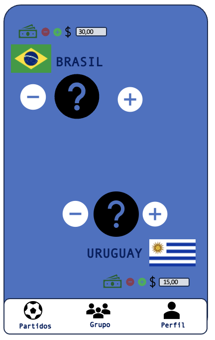
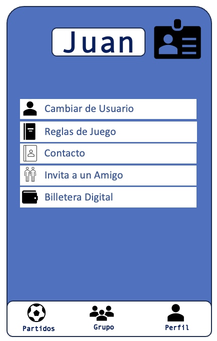
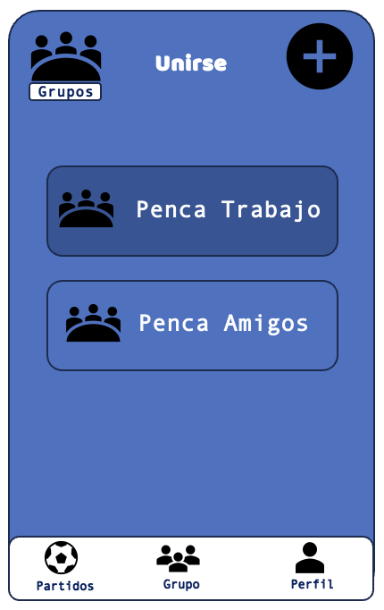
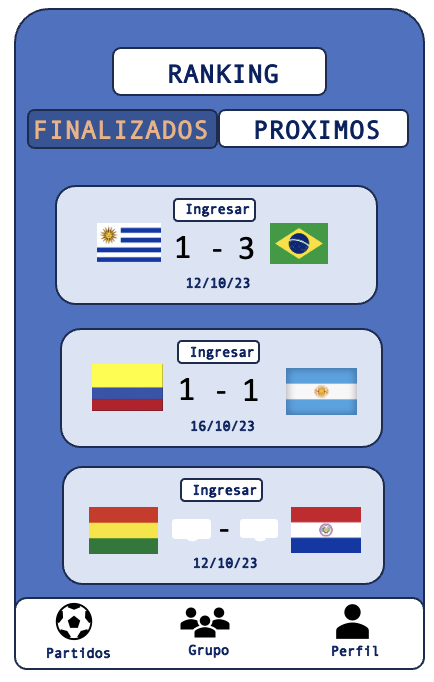
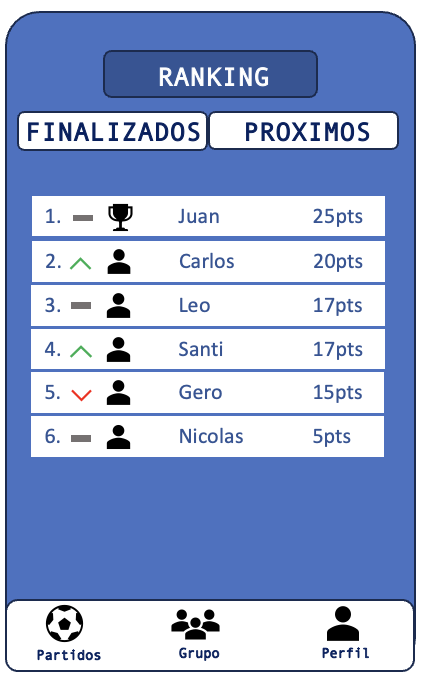

# Informe entrega 1

## Repositorio Git

Se creo un repositorio remoto en Github para trabajar con el proyecto, el cual se ventraliza toda la documentación y el codigo. El link HTTPS para acceder al es el siguiente: https://github.com/IngSoft-FIS-2023-2/obligatorio-n3a-grillolemos.git .

Por otra parte el repositorio remoto será clonado por cada integrante del equipo con el fin de trabajar localmente, teniendo un repositorio individual donde podremos trabajar sin necesidad de estar conectados a internet. 

El manejo del repositorio será mediante el uso de la terminal utilizando los siguientes comandos:

- **git init:** Este comando se utiliza para crear un nuevo repositorio Git en un directorio local. Inicia un repositorio vacío que puede utilizarse para controlar versiones de archivos en ese directorio.

- **git clone:** Permite crear una copia local de un repositorio Git existente en un servidor remoto. También puedes especificar una rama específica con -b para clonar solo esa rama en lugar de todas las ramas.

- **git commit:** Se utiliza para guardar los cambios realizados en tu directorio de trabajo en el repositorio Git. Debes incluir un mensaje descriptivo que explique los cambios realizados.

- **git pull:** Este comando se utiliza para obtener los cambios más recientes del repositorio remoto y fusionarlos en tu rama local. Es útil para mantener tu repositorio local actualizado.

- **git push:** Sube tus cambios locales al repositorio remoto. Esto es necesario para compartir tus modificaciones con otros colaboradores del proyecto.

- **git merge:** Se utiliza para unir dos ramas diferentes en Git. Puedes utilizarlo para incorporar los cambios de una rama en otra, como fusionar una rama de desarrollo en la rama principal.

- **git branch:** Este comando muestra una lista de todas las ramas en tu repositorio local. También puedes crear nuevas ramas y eliminarlas utilizando este comando.

- **git checkout:** Cambia entre ramas existentes en tu repositorio local. Te permite navegar y trabajar en diferentes ramas de desarrollo.

- **git add:** Prepara los cambios realizados en tus archivos locales para que sean confirmados. No guarda los cambios por sí solo; debes seguirlo con git commit para guardarlos en el repositorio.

- **git diff:** Muestra las diferencias entre los cambios realizados en tus archivos locales y la versión más reciente del repositorio. Es útil para revisar lo que has modificado antes de confirmar los cambios.

- **git stash:** Permite guardar temporalmente cambios locales sin confirmar. Esto te permite cambiar de tarea o rama sin perder tus cambios locales. Puedes aplicar estos cambios más tarde cuando regreses a la tarea original.

##  Versionado

Aplicar buenas prácticas de versionado es fundamental para el desarrollo de software de equipos y la gestión efectiva de proyectos. Lo que esto permite es rastrear cambios, colaborar de manera eficiente y revertir modificaciones en caso de requerirlo. Aquí presentamos algunas de las buenas prácticas que seran utilizadas:

- **Ramas separadas de 'main':**: La 2 ramas principales seran 'main' y 'develop', siendo las ramas de produccion y pre-producción. Además cada funcionalidad del proyecto tendra su rama correspondiente. Lo que esto permitees tener un control de versiones que nos ayude identificar los cambios realizados y llevar un control con mayor facilidad.

- **Resumen de commits:** Escribiremos mensajes de commit descriptivos y concisos que expliquen claramente el propósito de cada cambio. Dividiremos cambios grandes en commits más pequeños y lógicos.
Utilizaremos convenciones de nomenclatura para mensajes de commit, como el formato "Tipo: Descripción", donde el tipo puede ser "feat" para nuevas características, "fix" para correcciones de errores, "docs" para documentación, etc.

- **Evolución del proyecto:** Llevaremos un registro de la evolución del proyecto utilizando etiquetas (tags) para marcar versiones específicas. Esto facilita la identificación de versiones anteriores y el seguimiento de cambios importantes en el tiempo. Utilizaremos versiones semánticas para etiquetar las versiones. Esto ayuda a comprender rápidamente qué cambios se incluyen en cada versión (por ejemplo, 1.0.0, 1.1.0, 2.0.0).

## Elicitación

### Focus group

Una de las tecnicas de elicitación utilizadas fue la del focus group, las misma se llevo a cabo con diez integrantes de un campeonato de futbol interno de nuestro colegio donde juegan alumnos y exalumnos del mismo. Dos de los diez integrantes fueron quienes crearon la primera edición del campeonato y además son jugadores del mismo, por lo que creemos que nos puede aportar más valor. La persona restante es simplemente jugador del campeonato lo que creemos que puede tener otra mirada y tambien sumar valor al focus group.

#### Evidencia
 Las preguntas realizadas y la respuesta del grupo se puede encontrar [aqui](elicitacion/focus_group.md) 

### User Persona

En base a los resultados obtenidos se crearon 3 User Persona.

USERS PERSONA (CANTIDAD COMO SEGMENTOS EXISTA):

USER PERSONA 1:
NOMBRE: Juan
EDAD: 28 anos
PROFESION: Deportista
UBICACION: Montevideo, Uruguay

Descripcion:
A Juan le encantan los deportes en especial el futbol. Practica el deporte de forma amateur en el club de su barrio desde que es pequeno y es hincha y socio de uno de los principales clubes de su pais. Ademas del futbol local, siempre esta pendiente de los partidos de distintas ligas de futbol en especial las europeas como la Premier, Serie A de Italia y La Liga de Espana entre otras. En consecuencia, busca una aplicacion de pencas que le permita armar sus propias pencas con amigos, realizar los pronosticos y tener en tiempo real la clasificacion. La aplicacion deberia enviarle notificaciones sobre los horarios de los partidos, y los resultados una vez finalizan.

Necesidades y objetivos:
Armar y gestionar sus propias pencas de futbol.
Poder ver resultados y recibir notificaiones en tiempo real

USER PERSONA 2:
NOMBRE: Pedro
EDAD: 45 anos
PROFESION: Abogado
UBICACION: Montevideo, Uruguay

Descripcion:
A Pedro le es indiferente el futbol y no es hincha de ningun equipo, pero le encanta apostar. Por este motivo esta interesado en una aplicacion facil de usar y que contenga estadisticas actuales e historicas de resultados y posiciones de los equipos. Pedro busca una aplicacion que le permita generar un usuario, cargar un monto de dinero y sumarse a pencas existentes con montos de apuesta predefinidos de entrada.
rápida y sencilla.

Necesidades y objetivos:
Participar en pencas existentes con costo de entrada.
Acceder a informacion estadistica de equipos.
Aplicaion facil y clara de usar y administrar.
Permita generar usuario y cargar dinero.

USER PERSONA 3:
NOMBRE: Maria
EDAD: 25
PROFESION: Ingeniera en Sistemas
UBICACION: Montevideo, Uruguay

Descripción:
A Maria no le interesa el futbol, pero es una persona muy social a la que le gusta participar de todo tipo de actividades. Sus conocidos participan de pencas de torneos importantes como el Mundial. Maria busca una aplicacion que le sugiera los resultados a cargar y que le muestre porcentaje de favoritismo de cada equipo. Ella busca una aplicacion que le permita participar de las pencas sin la necesidad de conocer del deporte y que no le implique mucho tiempo.

Necesidades y objetivos:
Facil de usar.
Sugiera resultados y opcion de carga automatica de resultados sugeridos

## Especificación

### Requerimientos funcionales

 #### RF1: Registro de pronósticos.
 - **Actor:** Usuario.
 - **Descripción:** Los usuarios deben poder registrar sus pronósticos para los partidos del campeonato. Para esto deben poder seleccionar los partidos específicos en los que desean pronosticar. Es importante tener en cuenta que una vez que arranque el partido no puede ser modificado el resultado.
 - **Prioridad:** Alta.
 
 #### RF2: Visualización de resultados reales.
 - **Actor:** Usuario.
 - **Descripción:** Los usuarios deben poder ver los resultados de los partidos a medida que se juegan en tiempo real. Debe haber una notificación y actualización automática de los resultados.
 - **Prioridad:** Alta.

 #### RF3: Visualización de resultados pronosticados realizados por otros participantes.
 - **Actor:** Usuario.
 - **Descripción:** Los usuarios deben poder visualizar el resultado de cada participante en el partido seleccionado. Es importante que esta visualización este disponible recien una vez que arranca el partido, así no poder mirar el resultado de tus competidores y tomar decisiones en base a eso.
 - **Prioridad:** Media.

 #### RF4: Tabla de puntos.
 - **Actor:** Usuario.
 - **Descripción:** El sistema debe calcular automáticamente los puntos obtenidos por cada participante en función de la precisión de sus pronósticos. Debe mostrar una tabla de clasificación que enumere a los participantes en función de su puntuación total, ordenado de mayor a menor puntos, indicando la posicón en la tabla de cada participante.
 - **Prioridad:** Alta.

 #### RF5: Creación de grupos/Ingresar a grupos.
 - **Actor:** Usuario.
 - **Descripción:** El sistema debe permitir que los usuarios creen grupos como tambien ingresar a grupos ya creados. Esto permite tener varias tablas para competir en diferentes grupos por separado.
 - **Prioridad:** Media.

 #### RF6: Crear usuario/Ingresar a usuario.
 - **Actor:** Usuario.
 - **Descripción:** Para que cada persona pueda ser identificada con los resultados que ingresa la misma debera crear un usurario con contraseña, para que solo la persona tenga acceso.
 - **Prioridad:** Alta.

### Requerimientos no funcionales:

- **RNF1:** Usabilidad: Los formularios de pronósticos deben ser fáciles de completar, con campos de entrada claros y opciones intuitivas para seleccionar equipos y resultados. La interfaz de usuario debe ser responsiva y amigable para dispositivos móviles, ya que se estima que la gran mayoría de usuarios van a acceder desde sus telefonos.

- **RNF2:** Seguridad: Los datos de los usuarios, como nombres y contraseñas, deben estar cifrados para proteger la información personal. Se debe implementar un mecanismo de autenticación segura para evitar el acceso no autorizado a la plataforma.

- **RNF3:** Rendimiento: El sistema debe ser capaz de manejar al menos 100 usuarios. Los tiempos de carga de la plataforma no deben superar los 2 segundos para proporcionar una experiencia de usuario ágil.

- **RNF4:** Compatibilidad: El sistema deberá coportar sistemas operaticos en iphone desde el ios 12 y android desde 9.0. Además por si requieren entrar desde la web, la plataforma debe ser compatible con los navegadores web más utilizados, como Chrome, Firefox, Safari y Edge.

- **RNF5:** Cumplimiento Legal: El sistema debe cumplir con las regulaciones de privacidad de datos.

### Use Cases

#### Ingreso de pronostico de un partido
**Actores:** Usuario
**Precondición:** El usuario se encuentra loggeado en su usuario.
**Descripción:** El usuario se decidió por cargar un pronostico, por lo que abre la aplicación. Al abrir la aplicación la misma te lleva por defecto a la sección "partidos" y la sección "proximos". Ingresa el partido que desea cargar y la cantidad de goles de caga equipo.
**Curso básico:**
* 1) (Usuario) Abre la aplicación
* 2) (Sistema) Por defecto, abre la sección partidos/proximos.
* 3) (Sistema) Se despliega la lista de proximos partidos.
* 4) (Usuario) Scrolea hasta encontrar el partido y apreta ingresar.
* 5) (Sistema) Muestra intefaz para ingresar cantidad de goles de cada equipo.
* 6) (Usuario) Agrega cantidad de goles a pronosticar por equipo.
* 7) (Usuario) Presiona guardar.
* 8) (Sistema) El pronostico es registrado en el sistema.

**Curso alternativo:** Si no se guarda el resultado puede ser porque no se cargo la cantidad de goles de un equipo, un pop up avisa que es obligatorio así lo ingreso.

#### Ingresar al ranking de un grupo
**Actor:** Usuario
**Precondición:** El usuario se encuentra loggeado en su usuario.
**Descripción:** El usuario ya pronostico resultados y desea ver en que posición se encuentra en el ranking del grupo que tiene conn sus amigos del trabajo.
**Curso básico:**
* 1) (Usuario) Abre la aplicación
* 2) (Sistema) Por defecto, abre la sección partidos/proximos.
* 4) (Usuario) Selecciona debajo en el centro el botón "grupo"
* 5) (Sistema) Se despliega la lista de grupos al cual pertenece.
* 6) (Usuario) Selecciona el grupo "Penca Trabajo"
* 7) (Sistema) Se despliega lista de participantes ordenados por ranking.
* 8) (Usuario) Scrolea y puede ver la completitud de la lista.

**Curso alternativo:** Si no pertenece a ningún grupo aparece que para ver el ranking primero debe pertencer a un grupo. Debe ingresar o crear un grupo.
  
#### Ver resultados de los amigos.
**Actores:** Usuario
**Precondición:** El usuario se encuentra loggeado en su usuario.
**Descripción:** Los amigos del usuario ya pronosticaron resultados y desea ver el pronostico que ingresón en partidos previos.
**Curso básico:**
* 1) (Usuario) Abre la aplicación
* 2) (Sistema) Por defecto, abre la sección partidos/proximos.
* 4) (Usuario) Selecciona de arriba en el centro el botón "Finalizado"
* 5) (Sistema) Se despliega la lista de partidos que ya fueron finalizados.
* 6) (Usuario) Scrolea y elije el partido que quiere ver el pronostico de sus amigos.
* 7) (Sistema) Se despliega una lista con los pronosticos de sus amigos.
* 8) (Usuario) Scrolea y puede ver la completitud de la lista.

**Curso alternativo:** Si todavía no se jugó ningún partido aparece un pop up que no puede ingresar a partidos finalizados ya que todavia no se jugo ningún partido.

### User Stories

#### Historia usuario Jorge

**Título:** Penca con amigos del trabajo

**Como:** empleado de una empresa

**Quiero:** crear una penca en la que solo participen compañeros de trabajo

**Para:** crear un mejor ambiente en el trabajo y dar lugar a la socialización.

**Criterios de aceptación:**

- Debe ser capaz de crear un grupo de penca en el que todos los compañeros de trabajo puedan unirse.
- Debe permitir al usuario ver los pronósticos realizados por sus compañeros de trabajo dentro del grupo.
- Debe permitir al usuario competir en la penca y ver una tabla de posiciones que muestre el rendimiento de los participantes en la competencia.
- Estos criterios de aceptación establecen claramente lo que se espera del desarrollo de esta funcionalidad y cómo debería funcionar la penca en el contexto laboral. Esto proporciona una base sólida para que los desarrolladores implementen esta característica de manera efectiva.

#### Historia usuario Paula

**Título:** Penca con para apuestas

**Como:** persona que le gustan las apuestas

**Quiero:** crear una penca en la cual se realicen apuestas y según la posicón en la que termina sera la ganancia.

**Para:** crear un espacio de apuestas para ganar dinero en base a conocimiento de futbol

**Criterios de aceptación:**

- Debe ser capaz de crear un grupo de penca donde cualquier persona interesada pueda unirse, y el acceso a este grupo esté restringido a través de invitaciones o contraseñas.
- La plataforma debe permitir a los participantes ver y analizar los pronósticos realizados por otros miembros del grupo.
- Debe haber un sistema de seguimiento que muestre una tabla de posiciones actualizada, indicando quiénes lideran la penca.

#### Bocetos de UI

## Validación y verificación

En base a la informacion obtenida a lo largo del proceso se realizo un conjunto de preguntas para verificar que el producto cumplia con los requerimientos y especificaciones planteados en el inicio. Finalizado el proceso se concluyo que la app cumplia con los objetivos planteados. El proceso de creacion de usuario es rapido y facil y la interfaz super amigable. Como posibles mejoras se planteo mejorar el diseño.
Habiendo realizado la verificacion pasamos a la etapa de validacion para la cual armamos un prototipo y se le solicito al cliente y a un grupo determinado que realizaran pruebas de uso y funcinonalidades. 
Una vez realizadas las pruebas se le pidio a cada uno que respondiera una serie de preguntas sobre la experiencia de uso y un feedback general del producto.

|Nro. Req.|R1|R2|R3|R4|R5|R6|
|---------|--|--|--|--|--|--|
|
|¿La informacion se actualiza de forma rapida y consistente? |Si|Si|Si|No|Si|Si|
|¿La tabla de posiciones es consistente con los resultados obtenidos? |Si|Si|Si|Si|Si|Si|
|¿Permita crear y participar de distintos grupos? |Si|Si|Si|Si|Si|Si|
|¿Permite a los usuarios cargar plata en su cuenta? |Si|Si|Si|Si|Si|Si|
|¿Bloquea la modificacion de resultados una vez iniciado el partido? |Si|Si|Si|Si|Si|Si|
|¿Cumple con las normas de seguridad y proteccion de datos? |Si|Si|Si|Si|Si|Si|

## Reflexión

### Reflexión Carlos Grillo.

Tareas realizadas:
1) Repositorio git - definición de comandos a usar y definición de los mismos -> 1 hora
2) Versionado - determinación de formas de buenas practica para el versionado -> 2 hora
3) Elicitación - Focus Group - Armado de las preguntas, participación de la reunión y armado de las respuestas según lo conversado -> 4 horas
4) Especificaciones - Requerimientos funcionales y no funcionales - Definición de los mismos -> 2 horas
5) Especificaciones - Use Cases/User Stories - Armado de los mismos -> 3 horas
6) Validación y verificación - Discución y definición de las preguntas -> 1 hora
7) Reflexión -> 1 hora

Me pareció interesante poder participar del proceso previo a un desarollo de software, es algo que no tenía muy presente y que demuestra que cualquier proyecto no inicia con el desarollo de arranque, si no que existen estos pasos previos que son muy importantes. Me demostró la importancia de alinear todos los objetivos a lo que realmente se requiere, que creo que es a lo que estos metodos nos lleva. Que todos los esfuerzos sumen al proyecto y no hacer esfuerzos inecesarios que sin esta preparación deben haber.

También me gusto conocer toda la parte del versionado de git, yo no trabajo de desarollador y descubrí con esta materia el como funciona bien esta herramienta. Me parece que nos ayudara mucho, más que nada en la parte del desarollo para poder llevar un claro registro y un buen versionado que ante cualquier posible error nos ayudará a por corregirlo de una manera más eficaz y eficiente. 

Entender bien lo que quiere el cliente y adaptarnos a su necesidad me pareció lo más importante de todo esto, debe ser lo más dificil en la vida real. Esto se debe a que muchas veces el cliente quiere una cosa, pinsa que quiere otra cosa y en la comunicación con nosotros quizas entendemos otra. Justamente todo este analisis nos permite alinear estas 3 cosas donde realizaremos lo de una forma más efectiva lo que debemos realizar.

### Reflexion Individual - Juan Lemos

Tareas realizadas:
1) Repositorio git - definición de comandos a usar y definición de los mismos -> 1 hora
2) Versionado - determinación de formas de buenas practica para el versionado -> 2 hora
3) Elicitación - Creacion User Persona - Analisis de resultados del Focus Group y entrevistas -> 3,5 horas
4) Especificaciones - Requerimientos funcionales y no funcionales - Definición de los mismos -> 2 horas
5) Especificaciones - Diseño de Bocetos-> 4 horas
6) Validación y verificación - Armado de preguntas y analisis de resultados -> 1 hora
7) Reflexión -> 0,5 hora

Personalmente siento que el proyecto fue una buena oportunidad para ver y participar de las distintas etapas que componen un proyecto. Por otro lado me permitio asociar tareas que realizo en mi trabajo diario con los conceptos vistos. Siento que me llevo nuevas herramientas para poder darle un mejor orden y seguimiento a las tareas que hoy realizo. 

Ademas destaco las funcionalidades de git. Si bien ya conocia la herramienta y la habia utilizado en proyectos anteriores, no conocia las distintas funcionalidades que tenia y como se pueden ir estructurando y ordenando el proyecto. Sin duda una herramienta que seguire utilizando y de la cual quiero seguir averiguando funcionalidades.

### Reflexión Global.

Este trabajo nos brindó la oportunidad de ver la etapa previa al desarrollo del software, aprender de las buenas practicas que no en todos los trabajos se aprende. Además de esto estuvo bueno poder discutir y compartir opiniones de cada sección por lo que el hecho de que sea en grupo nos nutrio aún más.