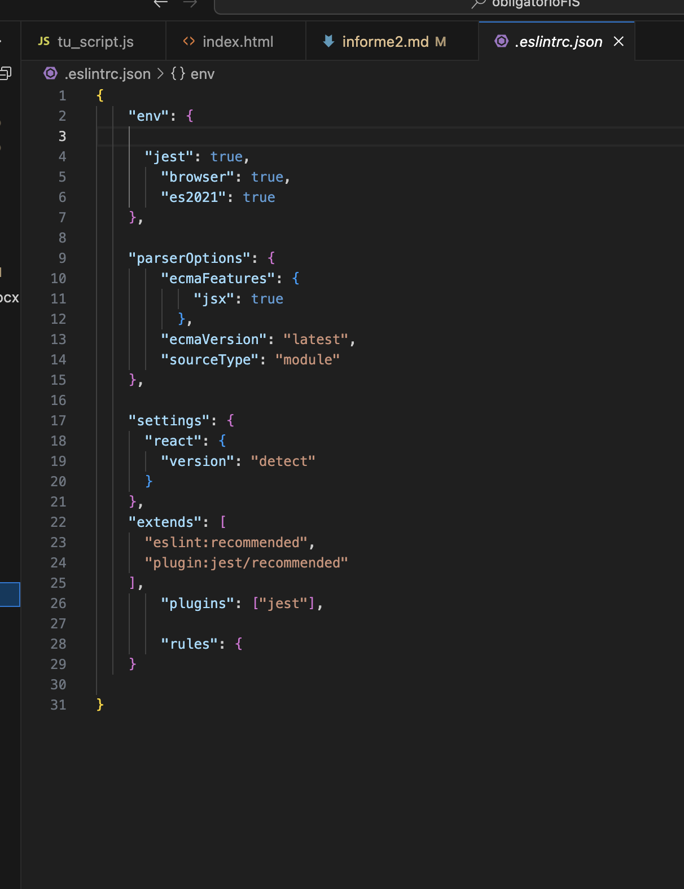
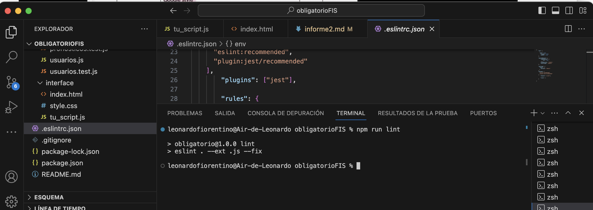
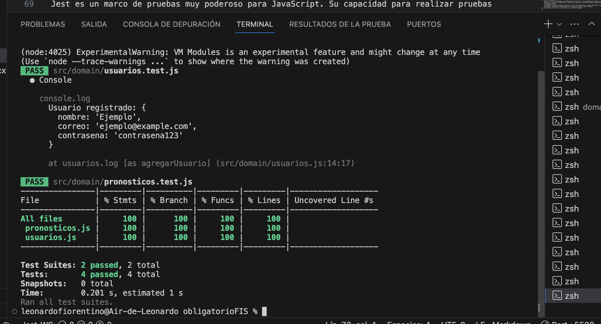

# Informe entrega 2

## Construcción

### Requerimientos implementados:

 **RF1: Registro de pronósticos:**
 - **Actor:** Usuario.
 - **Descripción:** Los usuarios deben poder registrar sus pronósticos para los partidos del campeonato. Para esto deben poder seleccionar los partidos específicos en los que desean pronosticar. Es importante tener en cuenta que una vez que arranque el partido no puede ser modificado el resultado.

**RF4: Tabla de puntos:**
 - **Actor:** Usuario.
 - **Descripción:** El sistema debe calcular automáticamente los puntos obtenidos por cada participante en función de la precisión de sus pronósticos. Debe mostrar una tabla de clasificación que enumere a los participantes en función de su puntuación total, ordenado de mayor a menor puntos, indicando la posicón en la tabla de cada participante.

 **F5: Creación de grupos/Ingresar a grupos:**
 - **Actor:** Usuario.
 - **Descripción:** El sistema debe permitir que los usuarios creen grupos como tambien ingresar a grupos ya creados. Esto permite tener varias tablas para competir en diferentes grupos por separado.

 **RF6: Crear usuario:**
 - **Actor:** Usuario.
 - **Descripción:** Para que cada persona pueda ser identificada con los resultados que ingresa la misma debera crear un usurario con contraseña, para que solo la persona tenga acceso.

### Librerias utilizadas:
- Libreria Bootstrap: Se utiliza para el diseño implementado al html.
- Libreria Jest: Se utiliza para realizar la pruebas unitarias y validar la cobertura de las pruebas.
- Libreria Eslint: Se utilizó para buscar y arreglar problemas ocasionado en javascript.

## Interfaz de usuario
En la parte de interfaces, solo tendremos index.html y main.js, una carpeta con logos, y el archivo de style.css.
En main.js tendra la programacion del lado del cliene la instansacion de las clases y la carga de datos para que el programa funcione. Esto se compone tambien de la programacion de creacion de grupo, de creacion de usuario, de resultados, , el html los link y la estructura estetica para ser llamado por el programa. La programacion con funciones, crea y ejecutan funciones para actualizar puntaje.
En sistemas grandes para industrias, se ve como la parte de interfaces no tiene logica o logica minima, se trabaja con un diseñador web, si no que es solo la interacción con el usuario final. 
El que trabaja con front-end tiene la tarea de cortar un diseño gráfico, dividir el diseño en partes más pequeñas y codificar (HTML y CSS) en sitios web que los usuarios finalmente usan. Con JavaScript se presenta todas las interacciones avanzadas entre la página y el usuario.
Y del lado de la aplicación la logica y la inteligencia de todo el aparato de procesamiento, para asi poder ejecutar del lado con mas poder de procesamiento e interactuar con la base de datos. En el cado de sistemas con alto volumen y procesos de mucho cambio no trancar el usuario final.
Para dividir esto, puede ser que en el plan del proyecto los programadores que hacen codigo para el procesamiento no toquen la interfaz y viceversa.
Buenas practicas para desarrollar en 
## Cumplimiento de las reglas de usabilidad.
1/ No se cumple con la visisbilidad del estado del sistema, se ve que la web no tiene un recorrido estetico y el comportamiento no tiene base en que el usuario pueda entenderlo.
Puede entenderse con las indicaciones en las cajas de texto que es lo que debe ingresar el usuario, pero eso es mínimo para ser un desarrollo profesional.
2/ No hay coincidencia entre el sistema y el mundo real, ya que no hay un funcionamiento acorde, en la creación del usuario y el ingreso de los goles para hacer el pronostico, debe avisarle al usuario y no lo hace, no cumple la medida.
3/ El usuario tiene el control y la libertad de llenar las casillas del usuario o del pronostico, tambien hay datos ingresados para que esto se cumpla. Si cumple con el control y libertad al usuario.
4/ Se es consistente, cuando se controlan las cajas de texto para que no pueda el usuario entrar cualquier cosa, tambien que en el pronostico sea solo números. si se cumple con la consistencia y los estandares.
5/ Previene errores ya que controla todo lo que el usuario ingresa para el fin del pronostico.
6/ Le recuerda al usuario que debe entrar en cada caja de texto y los botones para que cumplan cada accion. Si cumple el reconocer en lugar y recordar.
7/ Es una pagina tanto para expertos en web como para recien iniciados. Si cumple es flexible y tiene eficiencia de uso.
8/ Estetica ninguna pero diseño minimalista si porque es un proyecto acotado por tiempo y RRHH.
9/ Ayuda al usuario a reconocer, con mensajes que ingreso datos mal, diagnositicar entendiendo el mensaje el usuario sabe que debe repetir y con que criterio e ingresando de nuevo.
10/ No tiene ayuda por lo tanto no cumple, aunque hay que decirlo que es tan sencillo que no seria necesaria, y todo se puede hacer tan solo equivocandose y el sistema lo ayuda a hacerlo acertadamente.

## Codificación
Se divide en 'domain' 'interface'.
Domain: 
se programa es java script los archivos estan ordenados en nombreDeClase y nombreDeClase.test , y se organizan de la siguiente forma:
en el archivo nombreDeClase contiene la creacion de la clase.
nombreDeClase.Test contiene los test unitarios en javascript, en el html se programa el forntend y en la parte del dominio las funcionalidades con javascript. 

## Estandares de codigicacion

se ustiliza los estandares de html, css, javascript y google style, se adjunta evidencia de la ejecucion de control sin errores.

En la parte de html, se hace la ejecución de botones y creacion de formularios y en la parte de javascript se ejecutan las funciones para recibir los datos del html y hacer la funcionalidad deseada. Se crean 2 clases usuarios y pronosticos, y de ahi tambien los test unitarios. 

## Test unitario
En el domain tenemos cada clase (usuarios y pronostico)con su respectiva clase que prueba usuarios.test y pronosticos.test el funcionamiento, es la forma de probar el correcto funcionamiento de los módulo antes de integrarlo con el resto del sistema. En cada caso de prueba unitario se hace por un método independiente.
Jest es un marco de pruebas muy poderoso para JavaScript. Su capacidad para realizar pruebas unitarias, pruebas de integración y pruebas de extremo a extremo contribuye significativamente a la calidad del código.
La implementación de pruebas unitarias con Jest que hemos hecho, ayuda a garantizar que las funciones y componentes individuales de la penca funcionen como se espera.
Es probado por jest y no tiene errores, se adjunta imagen.

## Reflexión
Es muy potente trabajar con el enfoque dirigido por pruebas unitarias, al principio entendi que era algo absurdo y parte de documentacion, una vez que las purebas, constantemente esta uno probando la calidad del codigo que produce, que fomenta la creacion de pruebas en un ambiente de desarrollo y dirige el producto final hacia un codigo de altisima calidad. Es admirabla entender esta forma bastante nueva de trabajar creando continuamente por el desarrollador su propio control, automatizando así la verificacion continua.
En general, la combinación de Jest, ESLint y configuraciones en archivos JSON, JavaScript y CSS proporciona un entorno robusto para el desarrollo de software de alta calidad. La reflexión sobre su uso puede llevar a mejoras continuas en el código y en los procesos de desarrollo.
